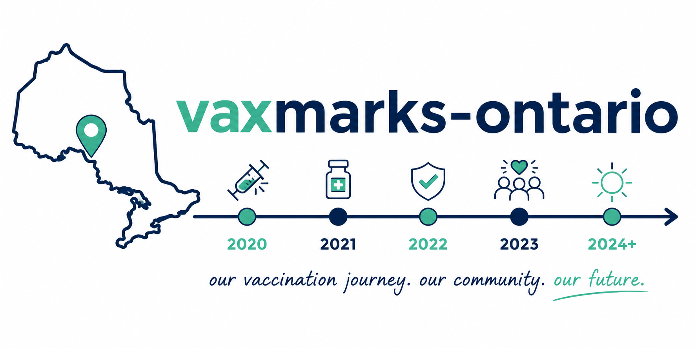

This dataset stores Ontario immunization and vaccine policy milestones in a simple
one-object-per-event JSON format.

It is designed to be used alongside time-based epidemiology or surveillance data
for vaccine-preventable diseases so that charts can show when important immunization
events happened relative to changes in disease trends.

## File format

The file is a JSON array stored in `/data/milestones.json`. Each item in the array is one milestone event.

## Event object fields

### id
A stable unique identifier.

Use lowercase snake-case.
Do not change an existing `id` once it has been published.

Examples:
- `ont-varicella-2004-first-dose-funded`
- `ont-covid-2020-rollout`

### date
An ISO-like date string.

Allowed forms:
- `YYYY`
- `YYYY-MM`
- `YYYY-MM-DD`

The amount of detail should match `date_precision`.

### date_precision
How precise the date is.

Allowed values:
- `day`
- `month`
- `year`
- `approximate`

Use:
- `day` when a source gives an exact date
- `month` when only month/year is reliable
- `year` when only the year is reliable
- `approximate` when sources disagree or only an estimated timing is possible

### agent
Identifier for the immunizing agent(s) linked to the event. Wherever possible, these should align with a [standard abbreviation scheme](https://cdc.gov/vaccines/hcp/vaccines-us/abbreviations.html). Multiple immunizing agents linked to an event should be presented as an array.

Examples:
- `"MMR"`
- `"PCV13"`
- `"HPV9"`
- `"DTaP-IPV"`
- `["HD-IIV3","IIV3","IIV4"]`

### disease
Array of disease labels linked to the event.

Keep terms short and consistent.

Examples:
- `["measles", "mumps", "rubella"]`
- `["varicella"]`
- `["invasive pneumococcal disease"]`
- `["COVID-19"]`

### event_type
The kind of milestone that the event represents.

Allowed values:
- `approval` (federal authorization or Health Canada market authorization)
- `funding` (becomes publicly funded)
- `eligibility` (public funding or access expands or narrows for a group)
- `schedule_change` (routine dose timing/product/series changes)
- `program` (launch of a new Ontario program)
- `recommendation` (NACI or OIAC recommendation milestone)
- `catch_up` (temporary or one-time catch-up program)
- `other` (use rarely, only if none of the above fit)

### population
Controlled vocabulary value describing the main population affected.

Recommended standard values:
- `general_population`
- `high_risk_people`
- `infants`
- `toddlers`
- `preschool_children`
- `school_age_children`
- `grade_7_students`
- `grade_8_girls`
- `adolescents`
- `adults`
- `older_adults_65_70`
- `older_adults_60_74_high_risk`
- `older_adults_75_plus`
- `pregnant_people`
- `multiple_priority_groups`

If an event affects several cohorts and splitting it would add little value,
use `multiple_priority_groups`.

### jurisdiction
Always:
- `Ontario`

### short_title
Very short title or label appropriate for a chart annotation.

Good labels:
- `Varicella funded`
- `UIIP starts`
- `HPV expands to boys`
- `COVID age 5–11 eligible`

### summary
One short sentence describing the event in plain language.

Good:
- `A single dose of varicella vaccine became publicly funded in Ontario for children at 15 months of age.`

Avoid:
- long paragraphs
- quotations
- causal claims that go beyond the source

### source_url
Primary source URL used for the event.

Use the most authoritative source available.
Prefer:
1. Ontario Ministry of Health or Ontario Newsroom
2. Public Health Ontario
3. Health Canada
4. NACI / Canadian Immunization Guide
5. Peer-reviewed or secondary sources only when primary sources are unavailable

### notes
Optional notes or caveats.

Use notes for:
- announcement vs implementation differences
- alternate dates
- why month/year precision was used
- explanation that an approval is federal but is included for Ontario relevance

### evidence_strength
Confidence in the event record.

Allowed values:
- `high`
- `medium`
- `low`

Recommended heuristic:
- `high`: explicit date in a primary source
- `medium`: good support but some ambiguity, indirect wording, or minor source conflict
- `low`: weak or incomplete evidence; should usually be reviewed before publication

## Editorial conventions

- One object per milestone event
- Prefer implementation dates over announcement dates for Ontario program events
- Prefer Health Canada authorization dates for approval events
- Do not invent exact days
- Keep terminology consistent across the file
- Keep summaries short enough to reuse in a tooltip or chart annotation
- If in doubt, lower precision rather than pretending certainty

## Example event

```json
{
  "id": "ont-varicella-2004-first-dose-funded",
  "date": "2004-09",
  "date_precision": "month",
  "agent": "Var",
  "disease": ["varicella"],
  "event_type": "funding",
  "population": "toddlers",
  "jurisdiction": "Ontario",
  "short_title": "Varicella funded",
  "summary": "A single dose of varicella vaccine became publicly funded in Ontario for children at 15 months of age.",
  "source_url": "https://www.publichealthontario.ca/-/media/Documents/V/26/varicella-ontario.pdf",
  "notes": "PHO gives September 2004 explicitly.",
  "evidence_strength": "high"
}
```

# Contributing

Contributions are welcome. The goal of this repository is to create a comprehensive, well-sourced record of immunization- and vaccine-related milestones relevant to Ontario.

If you identify missing events, incorrect dates, additional sources, or opportunities to improve data quality, please consider opening an issue or submitting a pull request.

When contributing:

- Whenever possible, cite primary sources (e.g., Ontario Ministry of Health, Public Health Ontario, Health Canada, or NACI documents).
- Include links to supporting references.
- Distinguish clearly between documented facts and interpretation.
- Preserve existing schema conventions and controlled vocabularies.
- If dates are uncertain, document the uncertainty rather than omitting the event.

This repository is intended to be a shared public health resource. Contributions from epidemiologists, immunization program staff, historians, researchers, students, and other interested collaborators are encouraged.

Questions, suggestions, and constructive feedback are always appreciated.